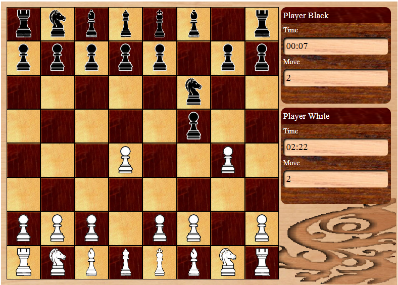

Chess game
========

An interactive chess game showing possible moves when a piece is clicked and keeping track of each players time.
* Used multiple classes, and class hierarchy for pieces.
* Handles pawn promotion which displays pop-up window where the user can select the piece which he/she wants to promote.
* Handles check and check mate. When it is check it displays dialog telling the players someone is in check.
* Move checking also excludes any moves that would have put you in check.
* It allows board setup using a simple string of sixty four characters (8 by 8 squares).

